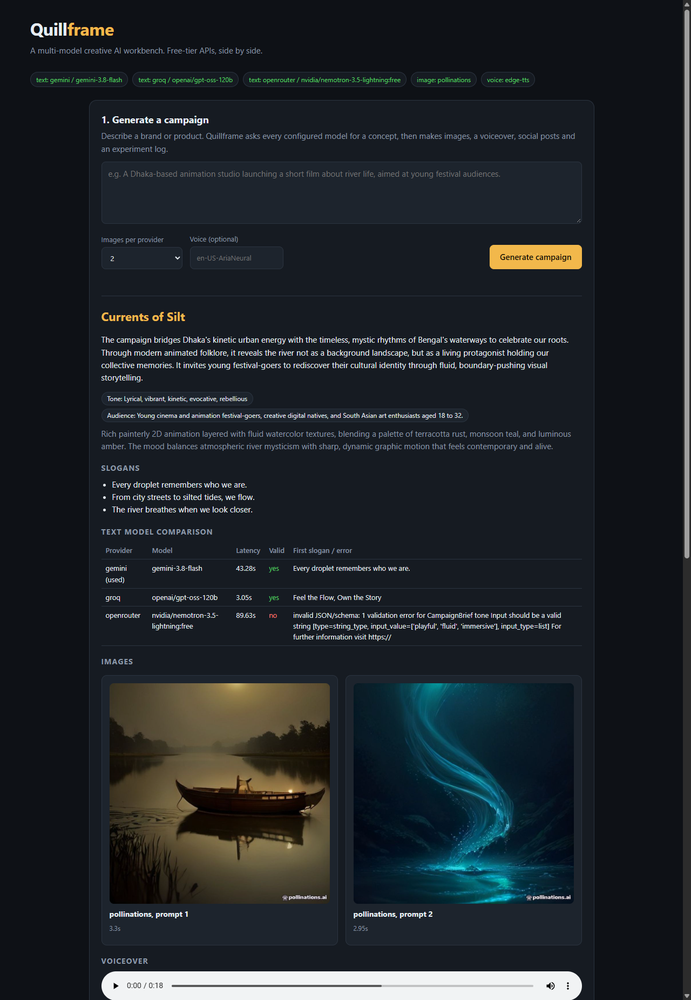
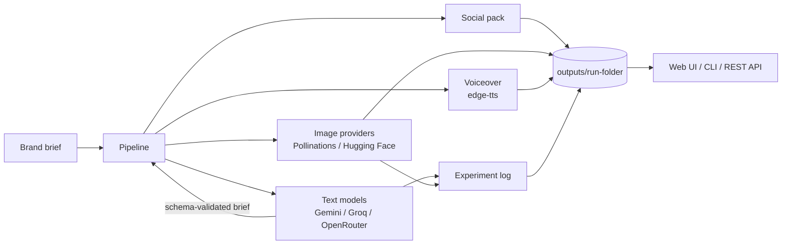

# Quillframe

**A multi-model creative AI workbench built entirely on free-tier APIs.**

Give Quillframe a short brand brief. It sends the brief to several AI models at once, compares how they perform, then turns the best result into a small campaign: a concept, slogans, images from two image generators, a voiceover, a social media pack for four platforms, and an **experiment log** that documents which tool did what, and how fast.




---

## What it does

| Step | What happens | Free service used |
|---|---|---|
| 1. Brief | The same prompt goes to every configured text model concurrently. Each answer is validated against a schema, and latency is recorded. | Gemini, Groq, OpenRouter |
| 2. Social pack | Platform-specific captions and hashtags (Instagram, LinkedIn, X, Facebook). Falls back to the next model if one fails. | same as above |
| 3. Images | Each image prompt is rendered by every available image provider, so you can compare them side by side. | Pollinations (no key), Hugging Face |
| 4. Voiceover | The campaign script is converted to an MP3. Many languages, including Bangla. | edge-tts (no key) |
| 5. Experiment log | A markdown report with latency tables, success rates, file links and space for your own notes. | n/a |

You can use it three ways: a **web UI**, a **CLI**, or the **REST API**.

## Architecture



### Design decisions

- **Provider abstraction.** Every text model implements one small interface (`TextProvider`). Adding a provider is one short file. Groq and OpenRouter share an OpenAI-compatible base class.
- **Failures are data, not crashes.** A provider that times out or hits a rate limit is recorded in the comparison table. The pipeline carries on with the models that worked.
- **Structured output.** Models are asked for JSON and the result is validated with Pydantic. Tolerant parsing handles code fences and chatty answers; single strings are coerced into lists.
- **Resilience on free tiers.** Requests retry with exponential backoff on `429` and transient `5xx` responses. Independent steps (social, images, voice) run concurrently.
- **Graceful degradation.** One API key is enough to run. More keys give a richer comparison. Hugging Face and OpenRouter are optional.
- **Tested without the network.** The test suite mocks HTTP, so it runs offline and in CI on Linux and Windows.

---

## Quick start (Windows, VS Code)

### 0. Prerequisites

- **Python 3.10 or newer** from [python.org](https://www.python.org/downloads/). During install, tick **"Add python.exe to PATH"**.
- **Git** from [git-scm.com](https://git-scm.com/download/win).
- **VS Code** with the *Python* extension.

Check in a terminal: `python --version` and `git --version`.

### 1. Open the project

Unzip the project, then in VS Code choose **File → Open Folder** and pick the `quillframe` folder. Open a terminal with **Ctrl + `** (PowerShell is fine).

### 2. Create a virtual environment and install

```powershell
python -m venv .venv
.venv\Scripts\Activate.ps1
pip install -r requirements.txt
```

> If PowerShell says *"running scripts is disabled"*, run this once, then activate again:
> `Set-ExecutionPolicy -Scope CurrentUser -ExecutionPolicy RemoteSigned`
>
> If VS Code asks which interpreter to use, pick the one inside `.venv` (Ctrl+Shift+P → *Python: Select Interpreter*).

### 3. Get free API keys

You need **at least one** text-model key. Two or three make the comparison much more interesting.

| Service | Where | Notes |
|---|---|---|
| **Gemini** | <https://aistudio.google.com/apikey> | Free key with any Google account. A *Gemini Pro subscription* (the app) is separate from API access, so create an AI Studio key. |
| **Groq** | <https://console.groq.com/keys> | Free tier, very fast Llama models. |
| OpenRouter *(optional)* | <https://openrouter.ai/keys> | Use model ids ending in `:free`. |
| Hugging Face *(optional)* | <https://huggingface.co/settings/tokens> | A read token enables a second image generator. |

Pollinations (images) and edge-tts (voice) need no key.

### 4. Configure

```powershell
copy .env.example .env
```

Open `.env` in VS Code and paste your keys after the `=` signs. **Never commit `.env`**: it is already in `.gitignore`.

### 5. Check your setup

```powershell
python -m quillframe status
```

You should see your text models marked `[ok]`.

### 6. Run it

**Web UI (recommended):**

```powershell
python -m quillframe serve
```

Open <http://127.0.0.1:8000>. Write a brand brief, press **Generate campaign**, and wait 30 to 90 seconds (free tiers are not instant).

**Command line:**

```powershell
# One prompt, every model, side by side
python -m quillframe compare "Write a tagline for an animation studio that uses AI"

# The full campaign pipeline
python -m quillframe campaign "A Dhaka animation studio launching a short film about river life, for young festival audiences"

# Fewer images, a different voice (Bangla example)
python -m quillframe campaign "Your brief here" --images 1 --voice bn-BD-NabanitaNeural
```

Every campaign is saved in `outputs\<timestamp>-<name>\`.

---

## What you get from a campaign run

```
outputs/20261008-013000-a-dhaka-animation-studio/
├── brief.json            # campaign name, concept, tone, slogans, image prompts, script
├── social.json           # captions and hashtags per platform
├── images/               # image_1_pollinations.jpg, image_1_huggingface.jpg, ...
├── voiceover.mp3
├── result.json           # full manifest, used by the web UI
└── EXPERIMENT_LOG.md     # latency tables, success rates, links, your notes
```

The **experiment log** is the part worth reading. It records, for the run you just did, how many models returned valid structured output, which was fastest, how each image provider performed, and leaves a "Your notes" section for your own conclusions.

## REST API

Interactive docs are available at <http://127.0.0.1:8000/docs> while the server runs.

| Method | Path | Purpose |
|---|---|---|
| GET | `/api/health` | Which text/image providers are active |
| POST | `/api/compare` | `{"prompt": "..."}` to every text model |
| POST | `/api/campaign` | `{"brief": "...", "images": 2, "voice": null}` runs the full pipeline |
| GET | `/api/campaigns` | Previous runs |
| GET | `/api/campaigns/{id}/log` | A run's experiment log as text |

## Configuration reference

All settings live in `.env` (see `.env.example`).

| Variable | Default | Meaning |
|---|---|---|
| `GEMINI_API_KEY` / `GEMINI_MODEL` | none / `gemini-2.5-flash` | Google AI Studio key and model |
| `GROQ_API_KEY` / `GROQ_MODEL` | none / `llama-3.3-70b-versatile` | Groq key and model |
| `OPENROUTER_API_KEY` / `OPENROUTER_MODEL` | none / `meta-llama/llama-3.3-70b-instruct:free` | OpenRouter key and model |
| `TEXT_PRIMARY` | `gemini` | Provider preferred when only one answer is needed |
| `POLLINATIONS_MODEL` | `flux` | Pollinations image model |
| `HF_TOKEN` / `HF_IMAGE_MODEL` | none / `black-forest-labs/FLUX.1-schnell` | Hugging Face token and image model |
| `IMAGES_PER_CAMPAIGN` | `2` | Images per provider per campaign |
| `EDGE_TTS_VOICE` | `en-US-AriaNeural` | Voice for the voiceover |
| `OUTPUT_DIR` | `outputs` | Where runs are saved |

## Project structure

```
quillframe/
├── quillframe/
│   ├── providers/        # TextProvider interface + Gemini, Groq, OpenRouter
│   ├── brief.py          # campaign brief schema and prompt
│   ├── social.py         # social pack schema and prompt
│   ├── images.py         # Pollinations + Hugging Face image providers
│   ├── voice.py          # edge-tts voiceover
│   ├── llm.py            # JSON-mode helpers: run on all models / fall back in order
│   ├── compare.py        # model arena
│   ├── logger.py         # markdown experiment log
│   ├── pipeline.py       # orchestrates a whole campaign
│   ├── server.py         # FastAPI app
│   ├── cli.py            # command-line interface
│   └── static/           # web UI (HTML, CSS, vanilla JS)
├── tests/                # offline tests with mocked HTTP
├── examples/             # sample generated campaign run
├── docs/                 # UI screenshots and documentation
├── .github/workflows/    # CI on Linux and Windows
└── .env.example
```

## Running the tests

```powershell
pip install -r requirements-dev.txt
pytest
```

## Troubleshooting

| Symptom | Fix |
|---|---|
| `No text-model API keys found` | You have not created `.env`, or the key lines are empty. Run `python -m quillframe status`. |
| Gemini `404 ... model not found` | Model names change. Run `python -m quillframe models` and put a listed name in `GEMINI_MODEL`. |
| `HTTP 429` | Free-tier rate limit. Quillframe retries; if it persists, wait a minute or lower `IMAGES_PER_CAMPAIGN`. |
| Pollinations fails or returns a non-image | The free service is occasionally busy or changes its rules. Retry, or add `HF_TOKEN` so another image provider is used. |
| Hugging Face `401` / `403` | The token is wrong or lacks inference permission. Create a new read token. |
| Hugging Face `503` | The model is warming up. Wait and retry. |
| Voiceover fails | edge-tts needs an internet connection. Also check your `--voice` name is valid. |
| `Activate.ps1 cannot be loaded` | Run `Set-ExecutionPolicy -Scope CurrentUser -ExecutionPolicy RemoteSigned`, then activate again. |
| `Address already in use` | Another program uses port 8000. Run `python -m quillframe serve --port 8001`. |

## Limitations

- Free tiers have rate limits and can change or disappear. Providers fail independently, and the pipeline reports that instead of hiding it.
- The web server has no authentication. It is intended for local use (it binds to `127.0.0.1` by default).
- Quality judgements (which slogan or image is best) are left to the human. The log gives you the data, not the verdict.

## Ideas for next steps

- Add more providers (any OpenAI-compatible service is a ~10-line class).
- Image-to-video with a free video model.
- Automatic quality scoring using a second model as judge.
- Persist runs in SQLite and add search and filtering in the UI.

## License

MIT. See [LICENSE](LICENSE).
